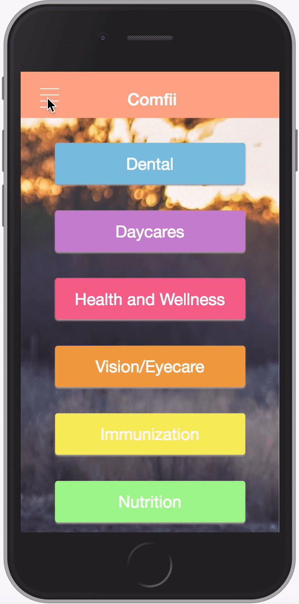

# ElevateHackathon
A solution for our Elevate Hack. We made an app for the City of Toronto so users can better find programs that they can access.

# Walkthrough

# An example for Dental Care:

This applications got this data from the City of Toronto's Website. We are using Google Maps to center around your location
and, and populate the nearest locations based on the addresses given

# Adding Children to your account:

This is for signing up. You can add a child to this account, and the point of this is to tailor programs offered by the city. For instance, a child aged 0-2 would have different programs than one aged 4-7.

# Changing between your children:

 Parents can have multiple children, so we added an ability to add multiple children, and switch views easily. You can see the programs offered specifically for that child. 

